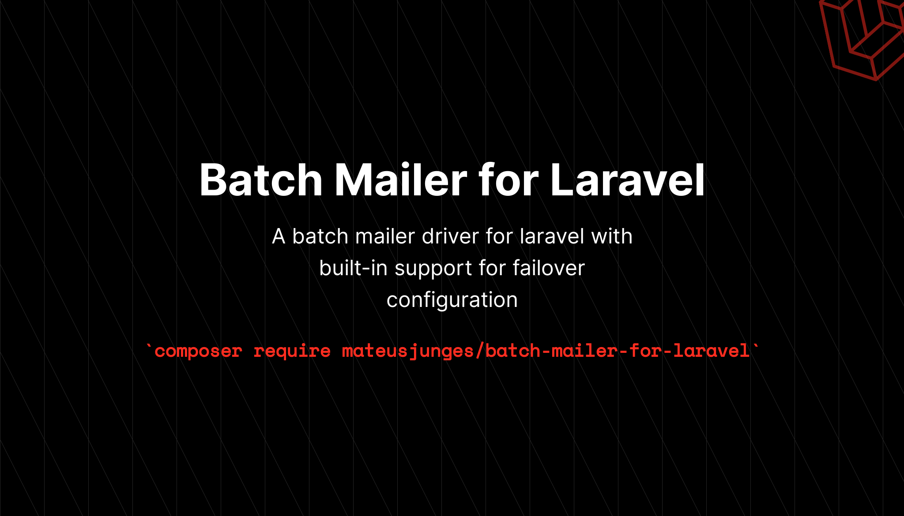

# Laravel batch mailer 

A batch mailer driver for laravel with built-in support for failover configuration.



## Installation
You can require this package using composer:

```text
composer require interaction-design-foundation/laravel-batch-mailer
```

Then, you can publish the configuration file using the command below:

```text
php artisan vendor:publish --tag=batch-mailer-config
```

## Driver/Transports

### Mailgun transport
To use the Mailgun transport, set the `default` option in your `config/batch-mailer.php` file to `mailgun`. 

After configuring your application's default batch mailer, verify that your `config/services.php` configuration contains the following options:

```php
'mailgun' => [
    'domain' => env('MAILGUN_DOMAIN'),
    'secret' => env('MAILGUN_SECRET'),
],
```

### Postmark Transport
To use the Postmark transport, set the `default` option in your `config/batch-mailer.php` file to `postmark`

After configuring your application's default batch mailer, verify that your `config/services.php` configuration contains the following options:

```php
'postmark' => [
    'token' => env('POSTMARK_TOKEN'),
],
```

## Failover configuration
Sometimes, an external service you have configured to send your application's email may be down. In these cases, it can be useful to define one or more backup mail delivery configurations that will be used in case your primary delivery is down.
To accomplish this, you should use the `failover` mailer, available by default with this package, which uses the `failover` transport. The configuration array for your application's `failover` mailer should contain an array of `mailers` that references the order in which mail drivers should be chosen for delivery:

```php
'mailers' => [
    'failover' => [
        'transport' => 'failover',
        'mailers' => [
            'postmark',
            'mailgun',
        ],
    ],
    // ...
],
```
Once your failover mailer has been defined, you should set this mailer as the default batch mailer driver used by your application by specifying its name as the name of the `default` configuration key within your application's `batch mail` configuration:

```php
'default' => env('BATCH_MAILER', 'failover'),
```

## Generating Mailables
When building Laravel applications, each type of batch emails sent by your application is represented by a "`Mailable`" class. The classes are stored in the `app/Mail/BatchMail` directory. Don't worry if you don't see this directory in your application, since it will be generated for you when you create your first mailable using the `make:batch-mail` command.

```bash
php artisan make:batch-mail ExampleBatchMail
```

## Writing Mailables
Once you have generated a mailable class, open it up, so we can explore its contents. Mailable class configuration is done in several methods, including the `build` and `attachments` methods.

## Configuring the sender

To configure who the email is going to be "from", you must use the `from` method, from the `Mailable` class:

```php
use InteractionDesignFoundation\BatchMailer\Mailable;

class ExampleBatchMail extends Mailable
{
    public function build()
    {
        return $this->from('sender@example.com');
    }
}
```

> **Note:**
> Add global from address


## Configuring the view

Within a mailable class, you may define the `view`, or which template should be used when rendering the email's content. Since each email typically uses a [Blade template](https://laravel.com/docs/9.x/blade) to render it's content, you have the full power and convenience of the Blade templating engine when building your emails HTML:

```php
public function build()
{
    return $this->from('sender@example.com')
        ->view('emails.view.example');
}
```

### Plain text emails
If you would like to define a plain-text version of your email, you may specify the plain-text template when creating the message's content definition. Like the `view` parameter, the `text` parameter should be a template name which will be used to render the contents of the email. You are free to define both an HTML and plain-text version of your message.

```php
public function build()
{
    return $this->from('sender@example.com')
        ->view('emails.view.example')
        ->text('emails.plain-text.example';
}
```
For clarity, the `html` method may be used as an alias of the `view` method:

```php
public function build()
{
    return $this->from('sender@example.com')
        ->html('emails.view.example')
        ->text('emails.plain-text.example';
}
```

## View data
### Via public properties
Typically, you will want to pass some data to your view that you can utilize when rendering the email's HTML. There two ways you may make data available to your view. First, any public property defined on your mailable clas will automatically be made available to the view. So, for example, you may pass data into your mailable class' constructor and set that data to public properties defined on the class.

```php
class OrderShipped extends Mailable
{
    use Queueable, SerializesModels;

    public function __construct(
        public \App\Models\Order $order
    ){}
 
    public function build()
    {
        //
    }
}
```

Once the data has been set to a public property, it will automatically be available in your view, so you may access it like you would access any other data in your Blade templates:

```blade
<div>
    Price: {{ $order->price }}
</div>
```

### Via the `with` parameter:

If you would like to customize the format of your email's data before it is sent to the template, you may manually pass your data to the view using the `with` parameter. Typically, you will still pass data via the mailable class' constructor; however, you should set this data to `protected` or `private` properties so the data is not automatically made available to the template:

```php
class OrderShipped extends Mailable
{
    use Queueable, SerializesModels;

    public function __construct(
        protected Order $order
    ){}

    public function build()
    {
        return $this->with([
            'orderName' => $this->order->name,
            'orderPrice' => $this->order->price,
        ]);
    }
}
```

Once the data has been passed to the `with` method, it will automatically be available in your view, so you may access it like you would access any other data in your Blade templates:

```blade
<div>
    Price: {{ $orderPrice }}
</div>
```

## Attachments
To add attachments to an email, you will add attachments to the array returned by the message's `attachments` method. First, you may add an attachment by providing a file path to the `fromPath` method provided by the `Attachment` class:

```php
use InteractionDesignFoundation\BatchMailer\ValueObjects\Attachment;
 
/**
 * Get the attachments for the message.
 *
 * @return \InteractionDesignFoundation\BatchMailer\ValueObjects\Attachment[]
 */
public function attachments()
{
    return [
        Attachment::fromPath('/path/to/file'),
    ];
}
```

When attaching files to a message, you may also specify the display name and/or MIME type for the attachment using the 